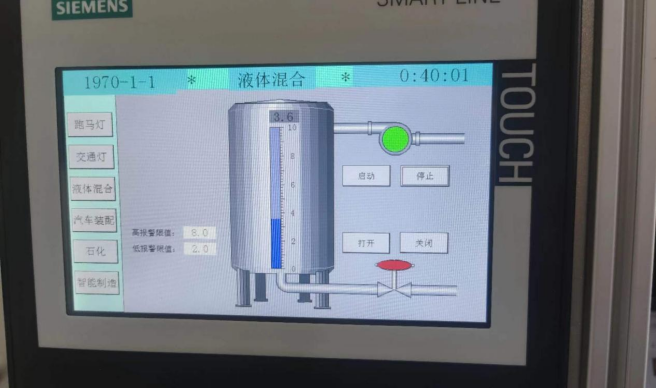
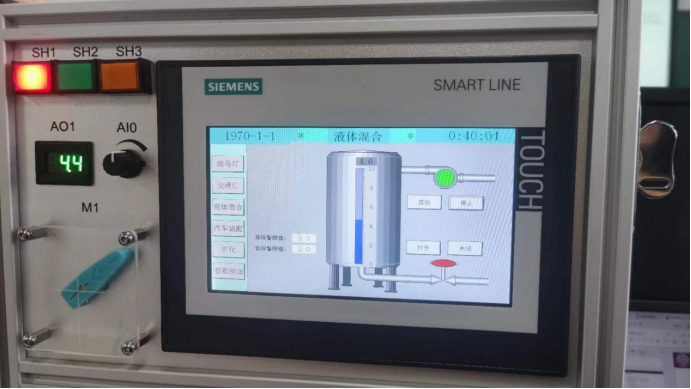
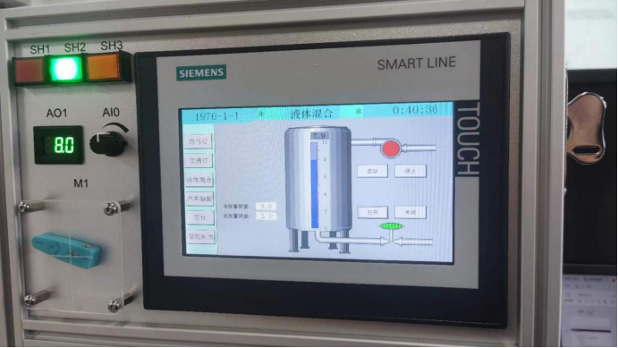
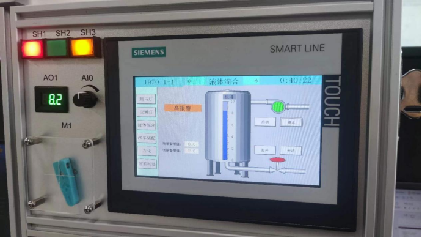
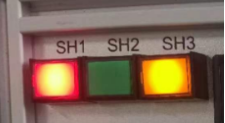

# 物联网安全课程实验报告

实验一

实验名称：“工控网络安全移动实验箱”安全需求分析

小组成员：梁晓储2110951 周涛2110651

专业：物联网工程

提交日期：2023.9.13

## 一、实验目的

通过工控实验箱了解工控系统基本工作原理，并对其进行安全需求分析

## 二、实验内容

了解工控系统的一般使用过程

1. 阅读纸质实验教程（HMI类）P1-P12，了解HMI及其配置过程

2. 阅读纸质实验教程（PLC类）P1-P18，了解PLC及其编程过程

3. 根据实验教程配置HMI（可能默认已经配置好无需更改）

4. 储水罐功能演示

5. 用网线连接电脑与试验箱
6. 将对应的储水罐程序重新下载至PLC中运行

## 三、实验要求及要点

根据对这套工控系统的了解及所学知识回答以下问题

1. （模拟）储水罐工业控制系统具有什么报警功能？
2. 为什么实验箱设计了触屏操作和物理按键两种控制储水功能的操作方式？

要点：

- 基于实验箱，总结工控系统工作基本原理
- 针对此试验箱模拟的工业控制环境，进行安全需求与风险分析

## 四、实验过程

### 储水罐功能演示

在HMI屏幕上点击“储水罐”

按SH1按钮，观察储水罐蓄水流程

按SH2按钮，观察储水罐停止蓄水流程

使用触屏重复上述操作

触屏点击“打开”/“关闭”，阀门开启/关闭排水

观察储水罐报警功能，SH3为指示灯

### 用网线连接电脑与试验箱

注意PC需要与实验箱处于同一局域网内，需要设置演示PC的对应网络接口的IP地址，试验箱局域网IP分布为192.168.1.XXX，XXX范围为1-254，其中1，3，4，70，158地址已被占用，其余地址可自定义设置。

### 将对应的储水罐程序重新下载至PLC中运行

1. 打开PLC.smart文件

2. 点击窗口上面的“下载”

3. 选择相应的通信接口（网卡），查找PLC。注意点击确定后下方会显示已连接

4. 在弹出的窗口点击“下载”

5. 结合阅读的实验教程手册，理解该系统开发过程

## 五、回答问题

1. （模拟）储水罐工业控制系统具有什么报警功能？

> 当罐内水位大于等于8.0或者小于等于2.0时，机器报警，指示灯SH3亮起，触摸屏显示高/低报警的提示

2. 为什么实验箱设计了触屏操作和物理按键两种控制储水功能的操作方式？

> 触屏操作可以提供直观的界面和交互体验，方便用户通过触摸屏幕来控制储水罐的功能。物理按键则可以提供更加实际的操作感，适用于一些用户更喜欢使用物理按钮进行控制的情况。通过同时设计触屏操作和物理按键两种操作方式，可以提高软件的易用性和灵活性，满足更多用户的需求。
>
> 物理按键操作可以作为备用的控制方式，当触屏操作出现故障或失效时，用户仍然可以通过物理按键来进行控制。这样可以防止因触屏操作故障而导致无法正常控制储水罐的情况发生，保证系统的可靠性和稳定性。
>
> 综上，触屏操作和物理按键操作可以相互补充，提供多重验证和控制方式。

## 六、收获感悟

通过本次实验，我对实验所用实验箱的结构与使用方式有了初步的认识，学习了解了使用网线连接实验箱和电脑以及将程序下载到PLC，对实验内容储水罐程序的实现也有了一定的理解，对物联网安全的内容了解更加深刻，希望在后面的课程中有更深入的学习。
