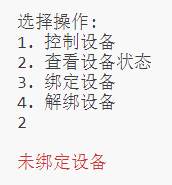
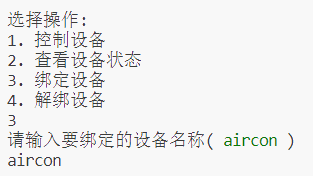
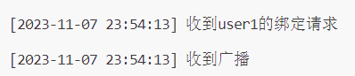
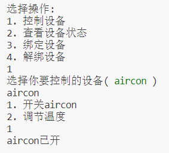
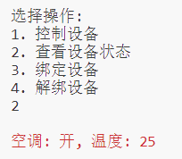
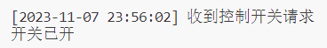

# 物联网安全课程实验报告

<center>实验三</center>


<center>实验名称：物联网设备加密通信设计与实现</center>

<center>小组成员：梁晓储2110951、张永豪2113061、王可一2112193</center>

<center>专业：物联网工程</center>

<center>提交日期：2023.11.8</center>

## 一、实验目的

了解目前主流的基于云的物联网通信原理，学会使用基本的密码学工具，并在消费物联网应用场景下构建安全加密通信方案


## 二、实验要求及要点

1. **基于MQTT协议，编程模拟实现智能家居应用场景下用户控制物联网设备的原型程序。**

**原型系统至少包含如下功能：**

支持至少2个用户，至少3个物联网设备同时在线。

> 注：
>
> 1. 物联网设备硬件功能仅用代码模拟即可，如输出“on”表示灯打开
>
> 2. 在不同的实体计算机（或虚拟机、手机）上部署MQTT服务器与MQTT客户端
>
> 3. 利用密码学知识与工具，查询相关资料，使该系统能抵御指令重放攻击。
>
> 4. 模拟核心的智能家居功能：用户操控设备、查看设备状态、设备绑定（可选功能：设备分享、设备注册）


2. **从攻击者的视角对本组的原型系统实现开展安全评估**

> 提示：请考虑不同的威胁模型，即不同的应用场景与敌手能力。例如，攻击者可能合法购买一个同款设备逆向分析，甚至可能共享使用过目标设备。


## 三、小组分工

| 姓名   | 学号    | 任务                   |
| ------ | ------- | ---------------------- |
| 梁晓储 | 2110951 | 代码实现和加密         |
| 王可一 | 2112193 | 安全评估和相关报告撰写 |
| 张永豪 | 2113061 | 总体报告撰写           |


## 四、实验内容

### 1. Emqx服务器搭建

- 下载EMQX，安装并进入`EMQX Dashboard 管理控制台`，完成物联网设备和用户控制端的账号添加


- 使用Python进行MQTT客户端对象的创建并连接到服务器

  ```python
  # 创建 MQTT 客户端对象
  client = mqtt.Client(username)
  client.username_pw_set(username, password)
  client.on_connect = on_connect
  client.on_message = on_message
  
  # 连接 MQTT 服务器
  client.connect(broker_address, 1883, 20)
  
  # 启用消息循环
  client.loop_forever()
  ```


### 2. 通过Python代码模拟用户控制端和物联网设备端


实现设备端和用户端的模拟，功能包括但不限于：

> 1. 控制设备
> 2. 查看设备状态（仅该用户控制端绑定过的设备）
> 3. 绑定设备
> 4. 解绑设备


### 3. 在虚拟机/其他设备上运行用户控制端，实现多设备

#### 虚拟机实现

虚拟机使用nat模式，共享主机网络连接，将设备和用户端的server设为WLAN的ipv4地址，进入客户端	可进行设备绑定和控制操作。


#### 其他主机实现

在配置处更改`broker_address`为MQTT服务器所在主机地址即可实现

```python
# 配置
broker_address = "<更改为MQTT服务器IP>"  # MQTT服务器地址
username = "light"  # MQTT用户名
password = "device1234"  # MQTT密码
```


### 4.对发送消息进行加密

```python
# 导入Fernet包
from cryptography.fernet import Fernet

# 加密密钥
encryption_key = b"09jyez3-73axU9OnTKKhT5DigEKqw2wutZ14z6MQwc8="  

# 创建加密器对象
cipher_suite = Fernet(encryption_key)

# 加密操作
encrypted_msg = cipher_suite.encrypt(json.dumps(msg).encode())

# 解密操作
decrypted_msg = cipher_suite.decrypt(msg.payload)
```

利用Fernet加密算法对消息进行加密和解密

Fernet是一种对称密钥加密算法，它使用相同的密钥来加密和解密数据


**加密原理**

1. 生成密钥

   使用了一个密钥字节序列 encryption_key，这个密钥是用于加密和解密消息的关键。

2. 密钥加密

   当需要发送消息时，首先构建消息内容，然后将消息内容转换成字节序列。接下来，使用Fernet密钥（encryption_key）创建一个Fernet加密器对象 cipher_suite

   1. 将消息内容进行序列化，通常使用JSON格式。然后将序列化后的消息字节作为输入传递给Fernet加密器对象，调用 encrypt 方法进行加密
   2. 加密后的消息成为密文，可以通过MQTT协议发送给接收者

3. 解密操作

   当接收到加密消息时，首先使用相同的密钥 encryption_key 创建一个Fernet解密器对象

   1. 接收到的密文消息可以通过MQTT协议获取，并将其传递给Fernet解密器的 decrypt 方法，以获得原始的加密数据
   2. 解密器会使用密钥 encryption_key 对密文进行解密，将其还原为原始的序列化消息字节
   3. 将解密后的字节数据反序列化，通常使用JSON，以获得原始消息内容


### 5. 设备绑定与功能测试

- 用户控制端首先需要进行设备绑定功能，否则无法进行 查看/操作 操作



- 用户控制端进行绑定操作时，会提示用户输入要绑定的设备名称，括号内会使用广播获取MQTT服务器内所有的物联网设备中未被用户绑定的设备并以 **绿色**字体呈现



​	同时物联网设备端会打印时间戳加输出



- 当绑定后，用户控制端可进行查看设备状态或控制设备操作





​	同时物联网设备端会打印时间戳加输出



## 五、系统方案安全性评估

### 1. 身份验证破解

虽然当前系统实现了客户端与设备端的绑定机制，只有绑定之后用户才可以向设备端发出指令进行控制。但是当前系统中使用未加密的用户名和密码传输，以及缺乏身份验证措施等安全问题。攻击者可能使用网络监听工具来截取不加密的通信流量，从而获取用户名和密码等敏感信息。还可以通过恶意软件、钓鱼邮件等手段，攻击者可以在受害者设备上安装键盘记录器或其他恶意工具，从而捕获用户的输入信息，获取到用户名和密码。 

防范：实施多因素身份验证机制，以增加攻击者获取对系统的访问权限的难度。还可以实施登录失败限制措施，例如限制尝试登录次数，暂时锁定账户或IP地址等，以防止暴力攻击和密码破解。定期分析登录日志文件、异常活动等以应对潜在的安全威胁。


### 2. 获取密钥破解

系统中的密钥以硬编码的形式保存。攻击者可以通过获得硬编码的密钥来解密从客户端到设备端的通信内容。可以利用密钥硬编码的漏洞来获取对通信内容的未经授权访问或篡改通信内容。攻击者可以通过获得硬编码的密钥来解密从客户端到设备端的通信内容。这使得攻击者能够窃听传输的敏感信息，例如用户名、密码或其他敏感数据。攻击者可以利用这些信息进行身份欺骗、隐私泄露或其他更严重的安全威胁。

防范：实现密钥分发机制，确保密钥在传输过程中通过安全的通信渠道传递，比如使用TLS/SSL等加密协议保护密钥的传输过程，以防止窃听和中间人攻击。对密钥进行定期更新，防范长期攻击，降低密钥泄露的风险。


### 3.  攻击者曾经连接过设备，对后续连接的用户进行攻击

攻击者可能在设备中注入恶意指令或代码，以获取对设备的控制权或执行未经授权的操作。可能导致设备失控。还可能篡改设备中存储的数据，比如用户的设置或者配置信息，造成设备功能异常。

防范：在每次设备交接或转让给新用户之前，对设备进行重置，将设备恢复到出厂设置状态，清除任何存储的用户数据和配置信息。并且采用安全的数据存储方案，如加密存储或数据完整性校验，以保护设备中存储的敏感信息免受攻击者的篡改或窃取。


## 六、回答问题

### 1. 智能家居设备的使用与工业控制系统面临风险有何差异？

> 1. 智能家居设备可能面临隐私泄露，网络攻击，如：DDos攻击等，弱密码和认证从而使设备更易受到攻击，或者被未经授权的人员物理访问，导致信息泄露或者设备被篡改。
>
> 2. 工业控制系统可能受到恶意软件或者病毒感染，导致生产中断或者设备受损，还有人为的操作错误可能导致生产过程中断或设备故障，从而影响生产，供应链中的恶意行为也可能导致恶意软件或漏洞被植入到控制系统中。
>
> 3. 工业控制系统面临的风险更为严重和复杂，因为其直接关系到工业生产的稳定性和安全性，一旦出现问题可能导致严重的经济损失甚至安全事故。相比之下，智能家居设备的风险相对较低，主要关注于用户隐私和设备的正常运行。


### 2. 列举几种可用来实现加密通信的常见密码算法，并进行对比分析

> 1. **对称加密算法**：常见代表：AES 、DES 、3DES 
>
> 特点：发送方和接收方共享相同的密钥，同一密钥用于加密和解密数据，速度较快，适用于大量数据的加密。
>
> 优点：效率高，适用于大规模数据的加密。
>
> 缺点：密钥管理复杂，密钥的传输可能会存在风险。
>
> 2. **非对称加密算法**：常见代表：RSA、ECC
>
> 特点：使用公钥加密数据，需要私钥才能解密，或者使用私钥签名数据，公钥验证签名的有效性。公钥私钥是成对出现的，不同的密钥用于加密和解密数据。
>
> 优点：提供了更高的安全性，无需共享私钥，可以用于密钥交换和数字签名等场景。
>
> 缺点：比对称加密算法更慢，适用于加密小块数据或密钥交换。
>
> 3. **哈希函数**：常见代表：SHA-256 
>
> 特点：将任意长度的输入转换成固定长度的哈希值，不可逆，相同输入得到相同输出。
>
> 优点：快速生成哈希值，适用于验证数据完整性、密码存储等场景。
>
> 缺点：不可逆，无法从哈希值还原原始数据。
>
> 4. **数字签名算法**：常见代表：RSA、DSA 
>
> 特点：使用私钥对数据进行签名，用公钥验证签名的有效性，确保数据的完整性和来源可信。
>
> 优点：提供了数据完整性和认证的保护。
>
> 缺点：相对复杂，需要合理地管理密钥。
>
> 5. **对比分析**：
>
> 安全性：非对称加密算法提供了更高的安全性，特别是在密钥交换和数字签名等场景下，相比对称加密算法更为安全。
>
> 效率：对称加密算法通常比非对称加密算法更高效，适用于大量数据的加密和解密。
>
> 密钥管理：非对称加密算法相对复杂，需要合理地管理公钥和私钥，而对称加密算法只需要管理一个密钥。
>
> 用途：不同的算法适用于不同的场景，如对称加密适用于大规模数据的加密，非对称加密适用于密钥交换和数字签名等场景。


### 3. 什么是虚拟机的NAT模式、桥接模式、Host-only模式？

> 1. NAT模式（Network Address Translation）：在NAT模式下，虚拟机会与主机共享一个网络接口，并通过虚拟网络设备（通常是虚拟网络交换机）连接到主机的网络上。主机会为虚拟机分配一个私有的IP地址，虚拟机可以访问外部网络，但外部网络无法直接访问虚拟机。这种模式适合于虚拟机需要访问外部网络，但不需要直接对外部网络提供服务的情况。
>
> 2. 桥接模式（Bridged Mode）：桥接模式允许虚拟机直接连接到主机所在的物理网络中，就像是主机上的一个独立设备。虚拟机会获得一个独立于主机的IP地址，可以直接与主机所在的网络进行通信，也可以与网络中的其他设备通信。这种模式适合于需要虚拟机与局域网内其他设备进行通信的情况，也适合于虚拟机需要提供服务给外部设备的情况。
>
> 3. Host-only模式：Host-only模式创建了一个独立的虚拟网络，仅包含主机和虚拟机之间的通信，与外部网络隔离。在这种模式下，虚拟机可以与主机相互通信，但不能直接访问外部网络或者外部设备。这种模式适合于创建一个隔离的开发或测试环境，可以在虚拟机之间进行通信，同时与外部网络隔离。


## 七、收获感悟

通过本次实验，我们深入了解了智能家居设备与工业控制系统的通信实现方式

智能家居设备利用MQTT协议实现设备间通信，采用加密算法保障通信安全；工业控制系统则注重稳定性与实时性，常采用专用协议，且通常在局域网内进行通信

两者面临的风险也存在差异，智能家居设备更注重隐私泄露，而工业控制系统则更关注设备稳定性和防止外部干扰